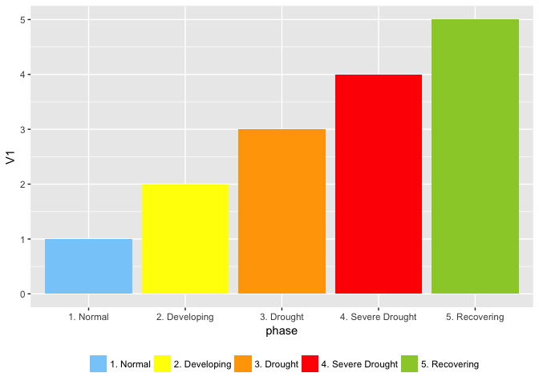

# Manual colours in ggplot
Ben Anderson (b.anderson@soton.ac.uk, `@dataknut`)  
Last run at: `r Sys.time()`  

# ggplot

http://ggplot2.tidyverse.org/reference/scale_manual.html - [@ggplot2]


```r
knitr::opts_chunk$set(echo = TRUE)
library(data.table) # not really needed but I like it :-)
library(ggplot2)
```

Go!

Sometimes we want to set and use specific colours. For example drought phases...

First set the colours:


```r
  normalCol <- "lightskyblue" # Normal
  develCol <- "yellow1" # Developing
  droughtCol <- "orange" # Drought
  sevDroughtCol <- "red" # Severe Drought
  recoveringCol <- "yellowgreen" # Recovering
```

Now make a plot:


```r
droughtPhaseDT <- as.data.table(rep(1:5))

droughtPhaseDT <- droughtPhaseDT[, phase := ifelse(V1 == 1,
                                                   "1. Normal",
                                                   NA)]
droughtPhaseDT <- droughtPhaseDT[, phase := ifelse(V1 == 2,
                                                   "2. Developing",
                                                   phase)]
droughtPhaseDT <- droughtPhaseDT[, phase := ifelse(V1 == 3,
                                                   "3. Drought",
                                                   phase)]
droughtPhaseDT <- droughtPhaseDT[, phase := ifelse(V1 == 4,
                                                   "4. Severe Drought",
                                                   phase)]
droughtPhaseDT <- droughtPhaseDT[, phase := ifelse(V1 == 5,
                                                   "5. Recovering",
                                                   phase)]

ggplot(droughtPhaseDT, aes(x = phase, y = V1, fill = phase)) +
  geom_col() +
  theme(legend.title = element_blank()) +
  theme(legend.position = "bottom") +
  scale_fill_manual(values = c(normalCol, develCol, droughtCol, sevDroughtCol, recoveringCol)
                    )
```

<!-- -->

# References
