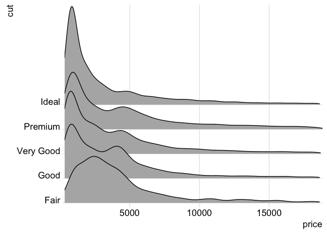

# joy plots in ggplot
Ben Anderson (b.anderson@soton.ac.uk, `@dataknut`)  
Last run at: `r Sys.time()`  

# Uses ggplot

http://ggplot2.tidyverse.org/reference/scale_manual.html - [@ggplot2]

joy plots: https://github.com/clauswilke/ggjoy [@ggjoy]. See also https://twitter.com/ClausWilke/status/885085499987304448 for a very nice example

A way of creating distribution slices.


```r
knitr::opts_chunk$set(echo = TRUE)
#library(devtools)
#install_github("clauswilke/ggjoy")
```

Now make a plot:


```r
library(ggplot2)
library(ggjoy)

ggplot(diamonds, aes(x=price, y=cut, group=cut, height=..density..)) +
     geom_joy(scale=4) +
     scale_y_discrete(expand=c(0.01, 0)) +
     scale_x_continuous(expand=c(0, 0)) + theme_joy()
```

<!-- -->

# References
