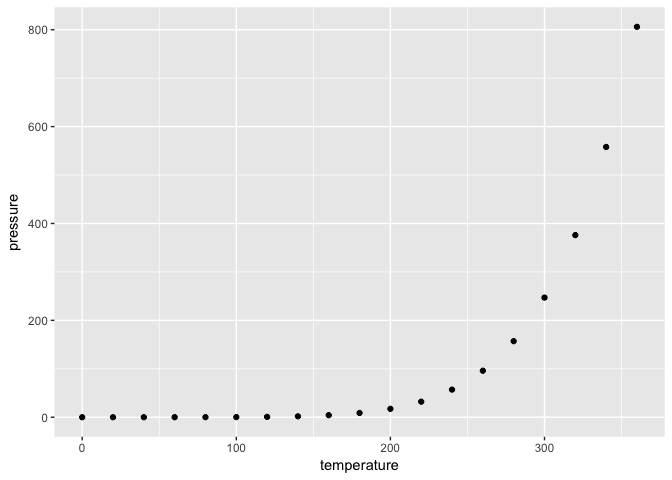

# Testing liftr
Ben Anderson (b.anderson@soton.ac.uk `@dataknut`)  
Last run at: `r Sys.time()`  


```r
# This is a function to install any packages that are not present
# Especially useful when running on virtual machines where package installation is not persistent. Like UoS sve :-(
# It will fail if the packages need to be installed but there is no internet access
# Courtesy of Luke Blunden
lb_myRequiredPackages <- function(x,y){
  for( i in x ){
    #  require returns TRUE if it was able to load package
    if( ! require( i , character.only = TRUE ) ){
      #  If package was not able to be loaded then re-install
      install.packages( i , repos=y , 
                        #type="win.binary" , comment out so runs on OS X etc
                        quiet=TRUE , dependencies = TRUE , verbose = FALSE )
      #  Load package after installing
      require( i , character.only = TRUE, quietly = TRUE )
    }
  }
}
```


```r
# Load libraries ----
# NB libraries required by saveFunctions.R should already be loaded
reqLibsLocal <- c("ggplot2" # slick graphs
                     )
print(paste0("Loading the following libraries using lb_myRequiredPackages: ", reqLibsLocal))
```

```
## [1] "Loading the following libraries using lb_myRequiredPackages: ggplot2"
```

```r
# Use Luke's function to require/install/load
lb_myRequiredPackages(reqLibsLocal,"http://cran.rstudio.com/")
```

```
## Loading required package: ggplot2
```


# Test plot


```r
ggplot(pressure, aes(x = temperature, y = pressure)) + 
  geom_point()
```

<!-- -->

Note that the `echo = FALSE` parameter was added to the code chunk to prevent printing of the R code that generated the plot.
