# OLS Regression modeling in R
Ben Anderson (b.anderson@soton.ac.uk, `@dataknut`)  
Last run at: `r Sys.time()`  


# Why are we here?

To learn how to do ols regression modelling in R (markdown) and specifically how to use broom [@broom] and car [@car] for diagnostics, stargazer [@stargazer] for model tables, data.table [@data.table] for data manipulation and ggplot [@ggplot2] for results visualisation. 

For more on regression try: http://socserv.socsci.mcmaster.ca/jfox/Courses/Brazil-2009/index.html 

So many birds and just one stone...


```r
# R has a very useful built-in dataset called mtcars
# http://stat.ethz.ch/R-manual/R-devel/library/datasets/html/mtcars.html

# A data frame with 32 observations on 11 variables.
# [, 1] 	mpg 	Miles/(US) gallon
# [, 2] 	cyl 	Number of cylinders
# [, 3] 	disp 	Displacement (cu.in.)
# [, 4] 	hp 	Gross horsepower
# [, 5] 	drat 	Rear axle ratio
# [, 6] 	wt 	Weight (1000 lbs)
# [, 7] 	qsec 	1/4 mile time
# [, 8] 	vs 	V/S
# [, 9] 	am 	Transmission (0 = automatic, 1 = manual)
# [,10] 	gear 	Number of forward gears
# [,11] 	carb 	Number of carburetors 

# Load required packages ----
x <- c("rms", #  regression tools
       "stargazer", # nice reporting of regressions
       "car", # regression tools
       "broom", # for tidying regression results
       "ggplot2", # for displaying regression results
       "data.table" # for fast data manipulation
       )
       
# do this to install them first if needed
#install.packages(x)
print("Loading required packages")
```

```
## [1] "Loading required packages"
```

```r
# be careful - this will return a FALSE if a package doesn't load but the script will NOT stop!
lapply(x, require, character.only = T)
```

```
## [[1]]
## [1] TRUE
## 
## [[2]]
## [1] TRUE
## 
## [[3]]
## [1] TRUE
## 
## [[4]]
## [1] TRUE
## 
## [[5]]
## [1] TRUE
## 
## [[6]]
## [1] TRUE
```

```r
# Load mtcars ----
mtcars <- mtcars

summary(mtcars) # base method
```

```
##       mpg             cyl             disp             hp       
##  Min.   :10.40   Min.   :4.000   Min.   : 71.1   Min.   : 52.0  
##  1st Qu.:15.43   1st Qu.:4.000   1st Qu.:120.8   1st Qu.: 96.5  
##  Median :19.20   Median :6.000   Median :196.3   Median :123.0  
##  Mean   :20.09   Mean   :6.188   Mean   :230.7   Mean   :146.7  
##  3rd Qu.:22.80   3rd Qu.:8.000   3rd Qu.:326.0   3rd Qu.:180.0  
##  Max.   :33.90   Max.   :8.000   Max.   :472.0   Max.   :335.0  
##       drat             wt             qsec             vs        
##  Min.   :2.760   Min.   :1.513   Min.   :14.50   Min.   :0.0000  
##  1st Qu.:3.080   1st Qu.:2.581   1st Qu.:16.89   1st Qu.:0.0000  
##  Median :3.695   Median :3.325   Median :17.71   Median :0.0000  
##  Mean   :3.597   Mean   :3.217   Mean   :17.85   Mean   :0.4375  
##  3rd Qu.:3.920   3rd Qu.:3.610   3rd Qu.:18.90   3rd Qu.:1.0000  
##  Max.   :4.930   Max.   :5.424   Max.   :22.90   Max.   :1.0000  
##        am              gear            carb      
##  Min.   :0.0000   Min.   :3.000   Min.   :1.000  
##  1st Qu.:0.0000   1st Qu.:3.000   1st Qu.:2.000  
##  Median :0.0000   Median :4.000   Median :2.000  
##  Mean   :0.4062   Mean   :3.688   Mean   :2.812  
##  3rd Qu.:1.0000   3rd Qu.:4.000   3rd Qu.:4.000  
##  Max.   :1.0000   Max.   :5.000   Max.   :8.000
```

# Examine dataset


```r
names(mtcars)
```

```
##  [1] "mpg"  "cyl"  "disp" "hp"   "drat" "wt"   "qsec" "vs"   "am"   "gear"
## [11] "carb"
```

```r
pairs(~mpg + disp + hp + drat + wt, labels = c("Mpg", "Displacement", "Horse power", 
    "Rear axle rotation", "Weight"), data = mtcars, main = "Simple Scatterplot Matrix")
```

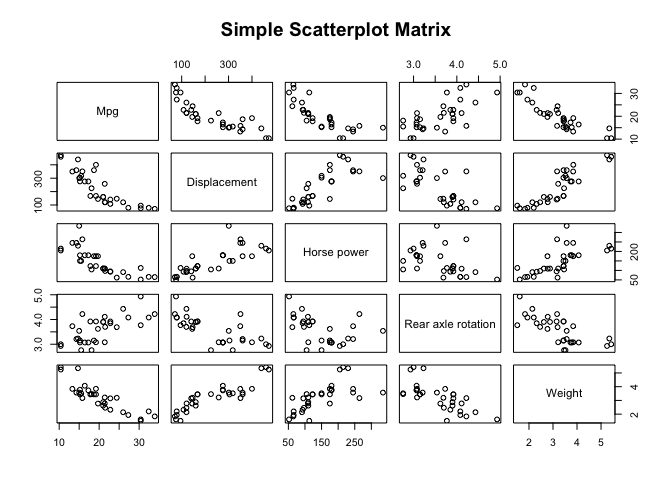<!-- -->

Establish normality of mpg (outcome variable of interest).


```r
hist(mtcars$mpg)
```

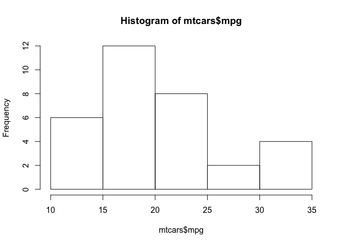<!-- -->

```r
qqnorm(mtcars$mpg)
qqline(mtcars$mpg, col = 2)
```

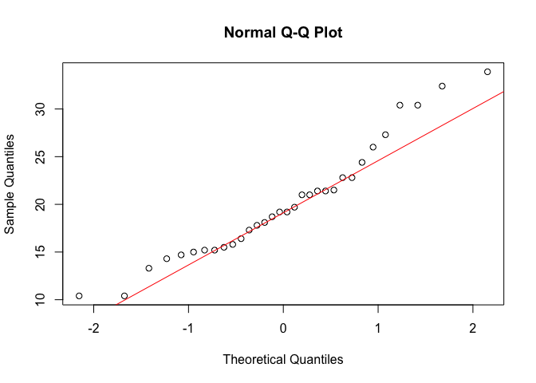<!-- -->

```r
shapiro.test(mtcars$mpg)
```

```
## 
## 	Shapiro-Wilk normality test
## 
## data:  mtcars$mpg
## W = 0.94756, p-value = 0.1229
```

```r
# if p > 0.05 => normal

# is it? Beware: shapiro-wilks is less robust as N ->
```

# Model with 1 term predicting mpg


```r
# qsec = time to go 1/4 mile from stationary
mpgModel1 <- lm(mpg ~ qsec, mtcars)

# results?
summary(mpgModel1)
```

```
## 
## Call:
## lm(formula = mpg ~ qsec, data = mtcars)
## 
## Residuals:
##     Min      1Q  Median      3Q     Max 
## -9.8760 -3.4539 -0.7203  2.2774 11.6491 
## 
## Coefficients:
##             Estimate Std. Error t value Pr(>|t|)  
## (Intercept)  -5.1140    10.0295  -0.510   0.6139  
## qsec          1.4121     0.5592   2.525   0.0171 *
## ---
## Signif. codes:  0 '***' 0.001 '**' 0.01 '*' 0.05 '.' 0.1 ' ' 1
## 
## Residual standard error: 5.564 on 30 degrees of freedom
## Multiple R-squared:  0.1753,	Adjusted R-squared:  0.1478 
## F-statistic: 6.377 on 1 and 30 DF,  p-value: 0.01708
```

```r
# Diagnostics ----

plot(mpgModel1)
```

<!-- --><!-- -->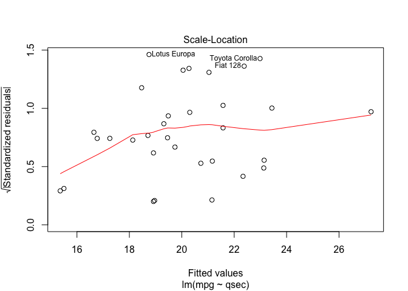<!-- -->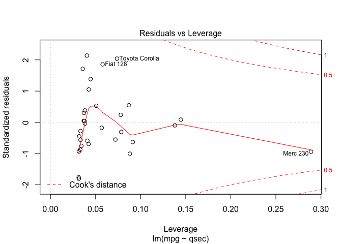<!-- -->

```r
# normality of residuals
hist(mpgModel1$residuals)
```

<!-- -->

```r
qqnorm(mpgModel1$residuals)
qqline(mpgModel1$residuals, col = 2)
```

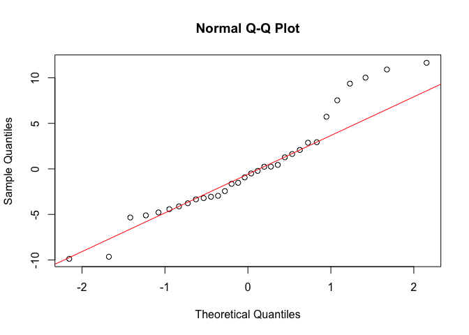<!-- -->

```r
shapiro.test(mpgModel1$residuals)
```

```
## 
## 	Shapiro-Wilk normality test
## 
## data:  mpgModel1$residuals
## W = 0.94193, p-value = 0.08494
```

```r
# it is usual to do these checks for standardised residuals - but the
# results are the same add casewise diagnostics back into dataframe
mtcars$studentised.residuals <- rstudent(mpgModel1)

qqnorm(mtcars$studentised.residuals)
qqline(mtcars$studentised.residuals, col = 2)
```

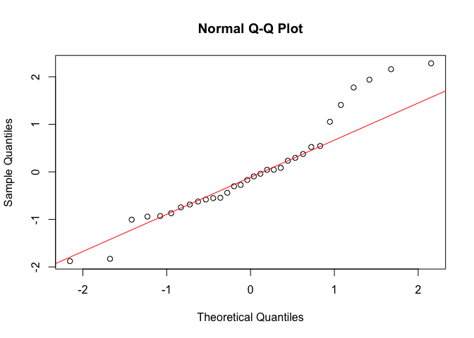<!-- -->

```r
shapiro.test(mtcars$studentised.residuals)
```

```
## 
## 	Shapiro-Wilk normality test
## 
## data:  mtcars$studentised.residuals
## W = 0.93996, p-value = 0.07469
```

```r
# if p > 0.05 => normal is it?  But don't rely on the test espcially with
# large n

# The 'car' package has some nice graphs to help here
qqPlot(mpgModel1)  # shows default 95% CI
```

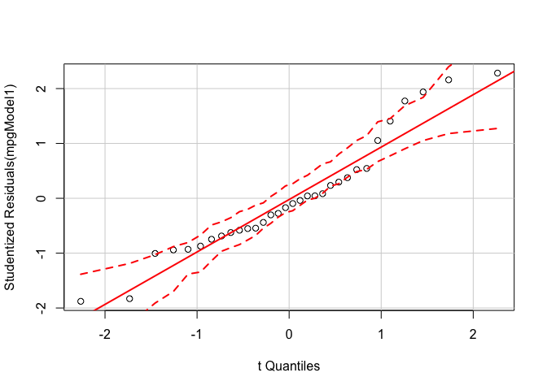<!-- -->

```r
spreadLevelPlot(mpgModel1)
```

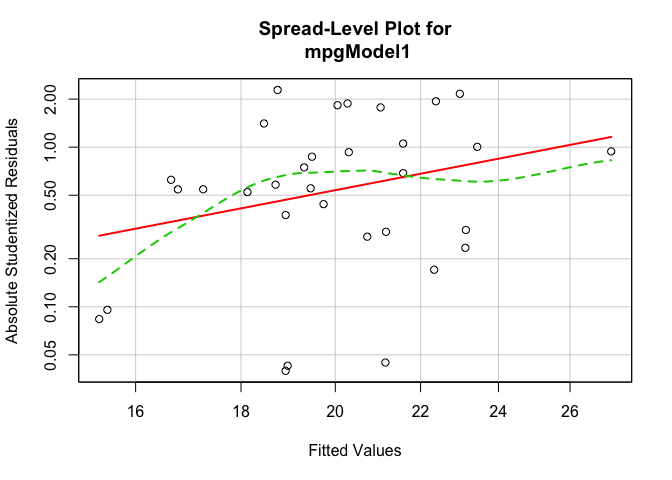<!-- -->

```
## 
## Suggested power transformation:  -1.490415
```

```r
# Do we think the variance of the residuals is constant?  Did the plot
# suggest a transformation? If so, why?

# autocorrelation/independence of errors
durbinWatsonTest(mpgModel1)
```

```
##  lag Autocorrelation D-W Statistic p-value
##    1       0.5922771     0.8065068   0.002
##  Alternative hypothesis: rho != 0
```

```r
# if p < 0.05 then a problem as implies autocorrelation what should we
# conclude? Why? Could you have spotted that in the model summary?

# homoskedasticity
plot(mtcars$mpg, mpgModel1$residuals)
abline(h = mean(mpgModel1$residuals), col = "red")  # add the mean of the residuals (yay, it's zero!)
```

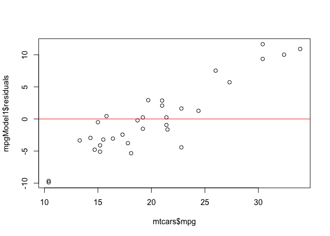<!-- -->

```r
# formal test
ncvTest(mpgModel1)
```

```
## Non-constant Variance Score Test 
## Variance formula: ~ fitted.values 
## Chisquare = 0.956535    Df = 1     p = 0.3280614
```

```r
# if p > 0.05 then there is heteroskedasticity what do we conclude from the
# tests?
```

go back to the model - what can we conclude from it?


```r
summary(mpgModel1)
```

```
## 
## Call:
## lm(formula = mpg ~ qsec, data = mtcars)
## 
## Residuals:
##     Min      1Q  Median      3Q     Max 
## -9.8760 -3.4539 -0.7203  2.2774 11.6491 
## 
## Coefficients:
##             Estimate Std. Error t value Pr(>|t|)  
## (Intercept)  -5.1140    10.0295  -0.510   0.6139  
## qsec          1.4121     0.5592   2.525   0.0171 *
## ---
## Signif. codes:  0 '***' 0.001 '**' 0.01 '*' 0.05 '.' 0.1 ' ' 1
## 
## Residual standard error: 5.564 on 30 degrees of freedom
## Multiple R-squared:  0.1753,	Adjusted R-squared:  0.1478 
## F-statistic: 6.377 on 1 and 30 DF,  p-value: 0.01708
```

# Model with more than 1 term

So our model was mostly OK (one violated assumption?) but the r sq was quite low. 

Maybe we should add the car's weight?


```r
# wt = weight of car
mpgModel2 <- lm(mpg ~ qsec + wt, mtcars)

# results?
summary(mpgModel2)
```

```
## 
## Call:
## lm(formula = mpg ~ qsec + wt, data = mtcars)
## 
## Residuals:
##     Min      1Q  Median      3Q     Max 
## -4.3962 -2.1431 -0.2129  1.4915  5.7486 
## 
## Coefficients:
##             Estimate Std. Error t value Pr(>|t|)    
## (Intercept)  19.7462     5.2521   3.760 0.000765 ***
## qsec          0.9292     0.2650   3.506 0.001500 ** 
## wt           -5.0480     0.4840 -10.430 2.52e-11 ***
## ---
## Signif. codes:  0 '***' 0.001 '**' 0.01 '*' 0.05 '.' 0.1 ' ' 1
## 
## Residual standard error: 2.596 on 29 degrees of freedom
## Multiple R-squared:  0.8264,	Adjusted R-squared:  0.8144 
## F-statistic: 69.03 on 2 and 29 DF,  p-value: 9.395e-12
```

```r
# Diagnostics ---- we whould run the same checks e.g.:
qqPlot(mpgModel2)  # shows default 95% CI
```

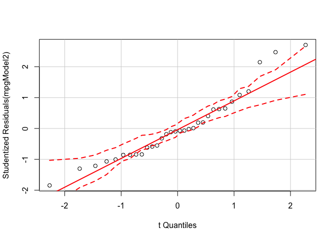<!-- -->

```r
spreadLevelPlot(mpgModel2)
```

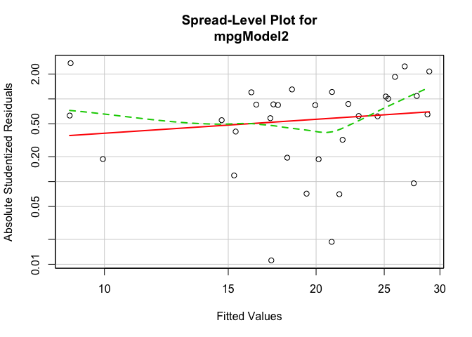<!-- -->

```
## 
## Suggested power transformation:  0.4388755
```

```r
# but also additional assumption checks (now there are 2 predictors)

# collinearity
vif(mpgModel2)
```

```
##     qsec       wt 
## 1.031487 1.031487
```

```r
# if any values > 10 -> problem

# tolerance
1/vif(mpgModel2)
```

```
##      qsec        wt 
## 0.9694744 0.9694744
```

```r
# if any values < 0.2 -> possible problem if any values < 0.1 -> definitely
# a problem

# autocorrelation/independence of errors
durbinWatsonTest(mpgModel2)
```

```
##  lag Autocorrelation D-W Statistic p-value
##    1       0.2438102       1.49595   0.088
##  Alternative hypothesis: rho != 0
```

```r
# if p < 0.05 then a problem as implies autocorrelation

# comparing models as a reminder:
summary(mpgModel1)
```

```
## 
## Call:
## lm(formula = mpg ~ qsec, data = mtcars)
## 
## Residuals:
##     Min      1Q  Median      3Q     Max 
## -9.8760 -3.4539 -0.7203  2.2774 11.6491 
## 
## Coefficients:
##             Estimate Std. Error t value Pr(>|t|)  
## (Intercept)  -5.1140    10.0295  -0.510   0.6139  
## qsec          1.4121     0.5592   2.525   0.0171 *
## ---
## Signif. codes:  0 '***' 0.001 '**' 0.01 '*' 0.05 '.' 0.1 ' ' 1
## 
## Residual standard error: 5.564 on 30 degrees of freedom
## Multiple R-squared:  0.1753,	Adjusted R-squared:  0.1478 
## F-statistic: 6.377 on 1 and 30 DF,  p-value: 0.01708
```

```r
summary(mpgModel2)
```

```
## 
## Call:
## lm(formula = mpg ~ qsec + wt, data = mtcars)
## 
## Residuals:
##     Min      1Q  Median      3Q     Max 
## -4.3962 -2.1431 -0.2129  1.4915  5.7486 
## 
## Coefficients:
##             Estimate Std. Error t value Pr(>|t|)    
## (Intercept)  19.7462     5.2521   3.760 0.000765 ***
## qsec          0.9292     0.2650   3.506 0.001500 ** 
## wt           -5.0480     0.4840 -10.430 2.52e-11 ***
## ---
## Signif. codes:  0 '***' 0.001 '**' 0.01 '*' 0.05 '.' 0.1 ' ' 1
## 
## Residual standard error: 2.596 on 29 degrees of freedom
## Multiple R-squared:  0.8264,	Adjusted R-squared:  0.8144 
## F-statistic: 69.03 on 2 and 29 DF,  p-value: 9.395e-12
```

```r
# test significant difference between models
anova(mpgModel1, mpgModel2)
```

```
## Analysis of Variance Table
## 
## Model 1: mpg ~ qsec
## Model 2: mpg ~ qsec + wt
##   Res.Df    RSS Df Sum of Sq      F    Pr(>F)    
## 1     30 928.66                                  
## 2     29 195.46  1    733.19 108.78 2.519e-11 ***
## ---
## Signif. codes:  0 '***' 0.001 '**' 0.01 '*' 0.05 '.' 0.1 ' ' 1
```

```r
# what should we conclude from that?
```

Whilst we're here we should also plot the residuals. h/t to https://gist.github.com/apreshill/9d33891b5f9be4669ada20f76f101baa for this.


```r
# save the residuals via broom
resids <- augment(mpgModel2)

# plot fitted vs residuals
ggplot(resids, aes(x = .fitted, y = .resid)) + geom_point(size = 1)
```

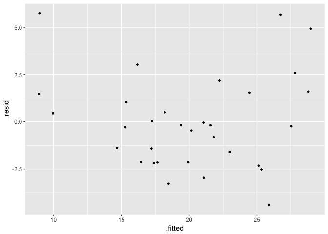<!-- -->

Hopefully we didn't see any obviously strange patterns (unlike that [gist](https://gist.github.com/apreshill/9d33891b5f9be4669ada20f76f101baa)).

# Reporting OLS results with confidence intervals

The p values tell you whether the 'effect' (co-efficient) is statistically significant. But only _you_ can decide if it is IMPORTANT!

It is usually better to calculate and inspect confidence intervals for your estimates.

This indicates:

 * statistical significance (if the CIs do not include 0) - just like the p value
 * precision - the width of the CIs shows you how precise your estimate is

You can calculate them using the standard error (s.e.) from the summary:

 * lower = estimate - (s.e.*1.96) 
 * upper = estimate + (s.e.*1.96)
 * just like for t tests etc (in fact this _is_ a t test!!)

Or use `confint()` which is more precise.

Print out the summaries again and calculate 95% confidence intervals each time.


```r
# Model 1
# use confint to report confidence intervals with bonferroni corrected level
bc_p1 <- 0.05/length(mpgModel1$coefficients)

# save results as log odds
# the cbind function simply 'glues' the columns together side by side
mpgModel1Results_bf <- cbind(Coef = coef(mpgModel1), # coefficients
                              confint(mpgModel1, level = 1 - bc_p1), # 95% CI
                             Pr = round(summary(mpgModel1)$coefficients[,4], 3) # p value if required
                             )
mpgModel1Results_bf
```

```
##                  Coef       1.25 %   98.75 %    Pr
## (Intercept) -5.114038 -28.77937200 18.551296 0.614
## qsec         1.412125   0.09263361  2.731616 0.017
```

```r
# Model 2
# use confint to report confidence intervals with bonferroni corrected level
bc_p2 <- 0.05/length(mpgModel2$coefficients)

# save results as log odds
# the cbind function simply 'glues' the columns together side by side
mpgModel2Results_bf <- cbind(Coef = coef(mpgModel2), 
                            confint(mpgModel2, level = 1 - bc_p2))

mpgModel2Results_bf
```

```
##                  Coef    0.833 %  99.167 %
## (Intercept) 19.746223  6.4012162 33.091229
## qsec         0.929198  0.2558134  1.602583
## wt          -5.047982 -6.2777749 -3.818189
```

Now we'll try reporting the two model using the stargazer package to get pretty tables. Note we use options to automatically create the 95% CI and to report the results on just one line per predictor. This is especially helpful for models with a lot of variables.


```r
stargazer(mpgModel1, mpgModel2, title = "Model results", ci = TRUE, single.row = TRUE, 
    type = "html")
```


<table style="text-align:center"><caption><strong>Model results</strong></caption>
<tr><td colspan="3" style="border-bottom: 1px solid black"></td></tr><tr><td style="text-align:left"></td><td colspan="2"><em>Dependent variable:</em></td></tr>
<tr><td></td><td colspan="2" style="border-bottom: 1px solid black"></td></tr>
<tr><td style="text-align:left"></td><td colspan="2">mpg</td></tr>
<tr><td style="text-align:left"></td><td>(1)</td><td>(2)</td></tr>
<tr><td colspan="3" style="border-bottom: 1px solid black"></td></tr><tr><td style="text-align:left">qsec</td><td>1.412<sup>**</sup> (0.316, 2.508)</td><td>0.929<sup>***</sup> (0.410, 1.449)</td></tr>
<tr><td style="text-align:left">wt</td><td></td><td>-5.048<sup>***</sup> (-5.997, -4.099)</td></tr>
<tr><td style="text-align:left">Constant</td><td>-5.114 (-24.772, 14.544)</td><td>19.746<sup>***</sup> (9.452, 30.040)</td></tr>
<tr><td colspan="3" style="border-bottom: 1px solid black"></td></tr><tr><td style="text-align:left">Observations</td><td>32</td><td>32</td></tr>
<tr><td style="text-align:left">R<sup>2</sup></td><td>0.175</td><td>0.826</td></tr>
<tr><td style="text-align:left">Adjusted R<sup>2</sup></td><td>0.148</td><td>0.814</td></tr>
<tr><td style="text-align:left">Residual Std. Error</td><td>5.564 (df = 30)</td><td>2.596 (df = 29)</td></tr>
<tr><td style="text-align:left">F Statistic</td><td>6.377<sup>**</sup> (df = 1; 30)</td><td>69.033<sup>***</sup> (df = 2; 29)</td></tr>
<tr><td colspan="3" style="border-bottom: 1px solid black"></td></tr><tr><td style="text-align:left"><em>Note:</em></td><td colspan="2" style="text-align:right"><sup>*</sup>p<0.1; <sup>**</sup>p<0.05; <sup>***</sup>p<0.01</td></tr>
</table>

# Visualise results using ggplot

Now we'll visualise them using broom and ggplot. Just to confuse you we're going to convert the data frames to data.tables. It makes little difference here but data.table is good to get to know for `data science`.


```r
# Broom converts the model results into a data frame (very useful!)
mpgModel1DT <- as.data.table(tidy(mpgModel1))
mpgModel1DT$ci_lower <- mpgModel1DT$estimate - qnorm(0.975) * mpgModel1DT$std.error 
mpgModel1DT$ci_upper <- mpgModel1DT$estimate + qnorm(0.975) * mpgModel1DT$std.error
mpgModel1DT <- mpgModel1DT[, model := "Model 1"] # add model label for ggplot to pick up
mpgModel2DT <- as.data.table(tidy(mpgModel2))
mpgModel2DT$ci_lower <- mpgModel2DT$estimate - qnorm(0.975) * mpgModel2DT$std.error 
mpgModel2DT$ci_upper <- mpgModel2DT$estimate + qnorm(0.975) * mpgModel2DT$std.error
mpgModel2DT <- mpgModel2DT[, model := "Model 2"] # add model label for ggplot to pick up

modelsDT <- rbind(mpgModel1DT, mpgModel2DT)
  
ggplot(modelsDT, aes(x=term, y=estimate, fill = model)) + 
  geom_bar(position=position_dodge(), stat="identity") + 
  geom_errorbar(aes(ymin=ci_lower, ymax=ci_upper), width=.2, # Width of the error bars 
                position=position_dodge(.9)) +
  labs(title = "Model results",
       x = 'Variable',
       y = 'Coefficient',
       caption = "Model results, 95% CI") +
  coord_flip() # rotate for legibility
```

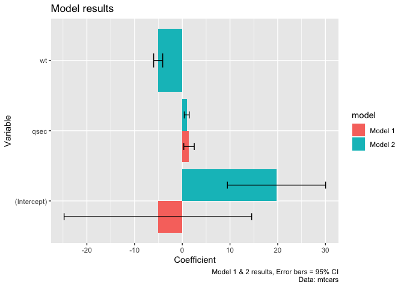<!-- -->

# About

## Runtime

Analysis completed in: 6.52 seconds using [knitr](https://cran.r-project.org/package=knitr) in [RStudio](http://www.rstudio.com) with R version 3.4.0 (2017-04-21) running on x86_64-apple-darwin15.6.0.

R packages used:

 * base R - for the basics [@baseR]
 * ggplot2 - for slick graphics [@ggplot2]
 * car - for regression diagnostics [@car]
 * broom - for tidy model results [@broom]
 * data.table - for fast data manipulation [@data.table]
 * knitr - to create this document [@knitr]
                     
# References
